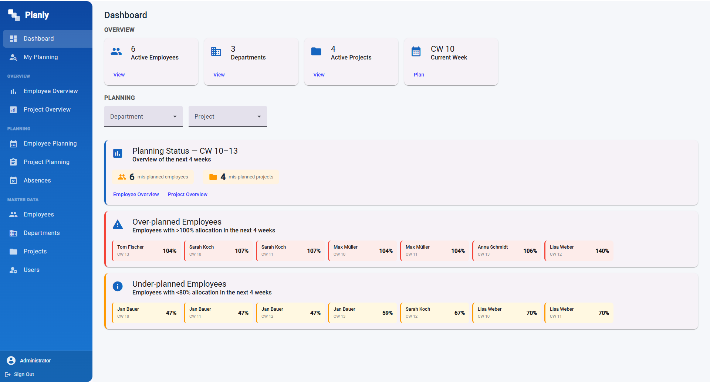
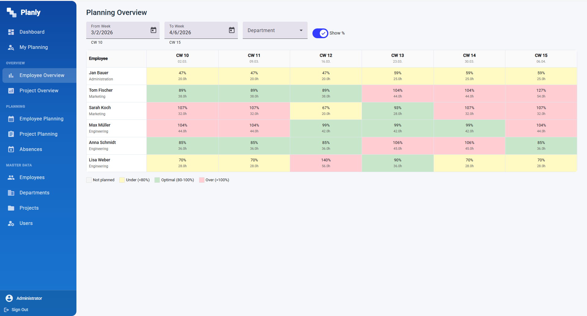
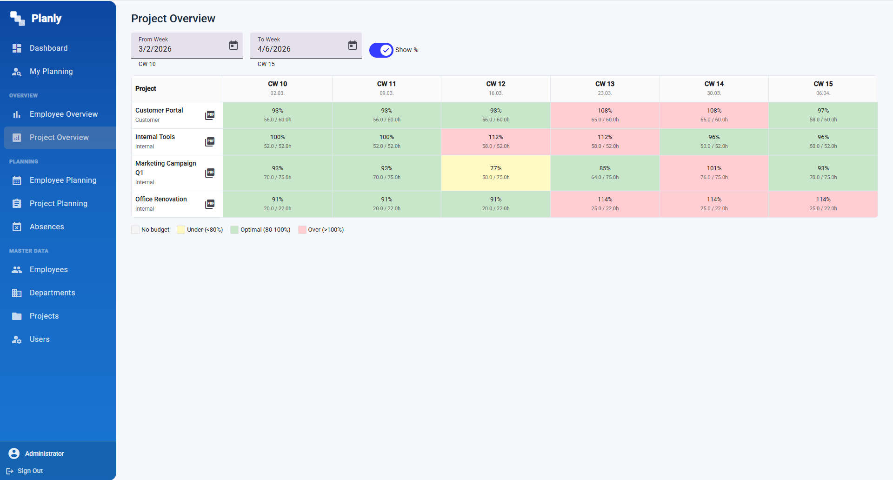

<div align="center">

# 📅 Resource Planning

**Employee capacity planning across projects and departments**


</div>

---

A web application for planning and monitoring employee capacity across projects and departments.

## Screenshots

**Dashboard** — overview cards, planning status, and per-week alerts for over/under-planned employees


**Employee Overview** — color-coded utilization grid across weeks and employees


**Project Overview** — project utilization vs. weekly budget
 Managers can allocate hours per employee and week, track over- and under-utilization, manage absences, and view planning status from both the employee and project perspective.

## Tech Stack

- **Frontend**: Angular 21 with Angular Material
- **Backend**: .NET 10 Web API with Entity Framework Core
- **Database**: SQLite (development)

## Prerequisites

- [.NET 10 SDK](https://dotnet.microsoft.com/download/dotnet/10.0)
- [Node.js 18+](https://nodejs.org/) with npm
- [Angular CLI](https://angular.dev/tools/cli) (`npm install -g @angular/cli`)

## Getting Started

### Backend

```bash
cd backend/ResourcePlanning.Api
dotnet run
```

The API will start at `http://localhost:5113` with Swagger UI at `http://localhost:5113/swagger`.

On first run, the database is automatically created and the default admin account is seeded (see [First Login](#first-login)).

Sample data (employees, departments, projects, allocations) is seeded separately and controlled by the `Seed:SampleData` setting — see [Seed Data](#seed-data) below.

### Frontend

```bash
cd frontend/resource-planning
npm install
ng serve
```

The app will be available at `http://localhost:4200`.

## First Login

The database is seeded with a default admin account on first startup:

| Field    | Value      |
|----------|------------|
| Username | `admin`    |
| Password | `admin123` |

Navigate to `http://localhost:4200/login` and sign in with these credentials. **Change the password after your first login** via the account menu.

The admin account has full access to all features. Additional users with specific roles (DepartmentManager, ProjectManager, Employee) can be created under **Master Data → Users**.

## Seed Data

The admin account is **always** created on startup if no users exist. All other sample data (employees, departments, projects, allocations) is optional and controlled via `appsettings.json`:

```json
"Seed": {
  "SampleData": false
}
```

| Value | Behaviour |
|-------|-----------|
| `false` (default) | Only the admin account is created — the app starts with an empty dataset |
| `true` | 6 employees, 3 departments, 4 projects, capacity allocations, project weekly budgets, and absences for 10 weeks starting from the first startup date are inserted |

In `appsettings.Development.json` this is set to `true` so a local development environment gets sample data automatically. For staging or production, leave it at `false` and enter real data through the UI.

> Sample data is only inserted once. If employees already exist in the database the seed is skipped, regardless of this setting.

## Features

- **Dashboard**: Overview cards with planning status, department/project filters, and alerts for over/under-planned employees per week
- **My Planning**: Per-employee view of project allocations and weekly utilization — accessible to all roles
- **Employee Management**: Create, edit, and deactivate employees with department assignments
- **Department Management**: Organize employees into departments with lead managers and supporting managers
- **Project Management**: Track customer and internal projects with team assignments
- **Capacity Planning Grid**: Visual weekly planning grid with color-coded utilization (green = 80–100%, orange = under, red = over)
- **Project Planning**: Plan capacity from the project perspective with weekly budgets
- **Planning Overview**: Read-only employee utilization view across weeks
- **Project Overview**: Read-only project utilization view across weeks
- **Absence Management**: Track employee absences per calendar week

## Roles

| Role | Access |
|---|---|
| `Admin` | Full system access; manage users and all data |
| `DepartmentManager` | Manage assigned departments, employees, and projects |
| `ProjectManager` | Manage projects they lead |
| `Employee` | View own planning data only |

## Database

The application uses **SQLite** with **Entity Framework Core** (code-first).

- **File location**: `backend/ResourcePlanning.Api/resourceplanning.db` (created automatically on first run)
- **Connection string**: Configured via `ConnectionStrings:DefaultConnection` in `appsettings.json`
- **Auto-migration**: Pending migrations are applied automatically on startup

### Configuration

Before running, set a strong JWT secret key in `backend/ResourcePlanning.Api/appsettings.json`:

```json
"Jwt": {
  "Key": "REPLACE_WITH_A_STRONG_SECRET_KEY_MIN_32_CHARS"
}
```

### Database providers

The application supports **SQLite** (development) and **SQL Server** (production), selected via `appsettings.json`:

| Setting | Value | Description |
|---|---|---|
| `Database:Provider` | `Sqlite` | Uses SQLite — migrations from `Data/Migrations/` |
| `Database:Provider` | `SqlServer` | Uses SQL Server — migrations from `Data/MigrationsSqlServer/` |

**Development** (`appsettings.Development.json`) defaults to SQLite with `Data Source=resourceplanning.db`.

**Production** (`appsettings.json`) defaults to SQL Server. Set the connection string before deploying:

```json
"Database": { "Provider": "SqlServer" },
"ConnectionStrings": {
  "SqlServer": "Server=your-server;Database=ResourcePlanning;User Id=sa;Password=your-password;TrustServerCertificate=True;"
}
```

### Managing migrations

```bash
# Add a SQLite migration (development)
cd backend/ResourcePlanning.Api
dotnet ef migrations add <Name> --output-dir Data/Migrations

# Add a SQL Server migration (production)
$env:DB_PROVIDER="SqlServer"
dotnet ef migrations add <Name> --output-dir Data/MigrationsSqlServer
$env:DB_PROVIDER=""
```

```bash
cd backend/ResourcePlanning.Api
dotnet ef migrations add <MigrationName> --output-dir Data/Migrations
dotnet ef database update
```

## Project Structure

```
ressource-planning/
├── backend/
│   ├── ResourcePlanning.Api/
│   │   ├── Controllers/     # API endpoints
│   │   ├── Data/            # DbContext, migrations, seed data
│   │   ├── DTOs/            # Request/response models
│   │   ├── Entities/        # Database entities
│   │   ├── Middleware/      # Error handling
│   │   ├── Services/        # Business logic
│   │   └── Program.cs       # App configuration
│   └── ResourcePlanning.Tests/  # xUnit backend tests
├── frontend/
│   └── resource-planning/
│       └── src/app/
│           ├── core/        # Services, models, guards, interceptors, utils
│           ├── shared/      # Shared components (confirm dialog)
│           └── features/    # Employees, departments, projects, planning,
│                            # absences, dashboard, my-planning, users, auth
└── README.md
```

## Running Tests

```bash
# Backend (xUnit)
cd backend/ResourcePlanning.Tests
dotnet test

# Frontend (vitest)
cd frontend/resource-planning
npm test
```

---

<div align="center">

*This application was built entirely with the assistance of [Claude Code](https://claude.ai/claude-code) — Anthropic's AI-powered CLI for software development.*

</div>
